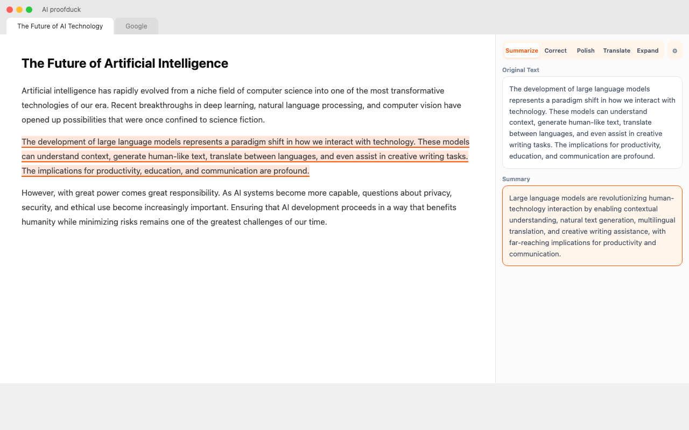
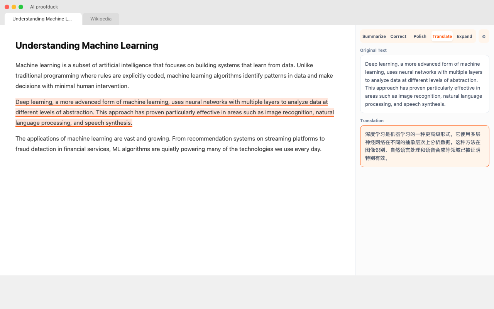
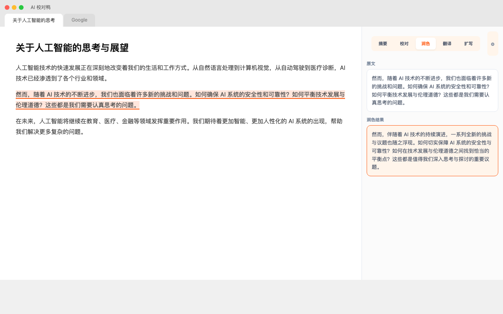
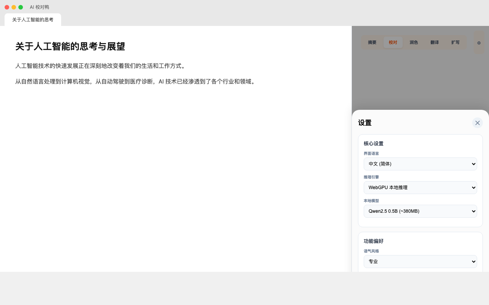

<div align="center">
  <h1>AI 校对鸭 (AI proofduck)</h1>
  
</div>

[English](./README.md) | [日本語](./README.ja.md) | [한국어](./README.ko.md) | [Español](./README.es.md) | [Français](./README.fr.md) | [Changelog](./CHANGELOG.md)

---

## 📸 产品截图

<div align="center">
  <table style="width: 100%; border-collapse: collapse; border: none;">
    <tr>
      <td align="center" style="border: none;">
        <br/>
        <sub>摘要界面 (英文)</sub>
      </td>
      <td align="center" style="border: none;">
        <br/>
        <sub>翻译界面 (英文)</sub>
      </td>
    </tr>
    <tr>
      <td align="center" style="border: none;">
        <br/>
        <sub>润色界面 (中文)</sub>
      </td>
      <td align="center" style="border: none;">
        <br/>
        <sub>设置面板</sub>
      </td>
    </tr>
  </table>
</div>

---

**AI 校对鸭** 是一款基于浏览器侧边栏的混合引擎写作助手。

它采用**本地优先的引擎路由**：
1. 优先使用 Chrome 内置 AI（Gemini Nano）
2. 不可用时可切换本地 WebGPU/WASM 模型
3. 需要更强效果时可接入在线 API
4. 翻译模式支持第三方兜底，保障安装后可快速体验

## ✨ 核心功能

- **🚀 多模式写作辅助**（翻译优先）：
  - **翻译 (Translate)**：精准翻译，支持全文翻译。
  - **摘要 (Summarize)**：快速提炼长文核心观点。
  - **纠错 (Correct)**：修正语法错误与拼写问题。
  - **润色 (Proofread)**：优化语句通顺度，提升专业性。
  - **扩写 (Expand)**：基于现有内容丰富细节。
- **🔒 本地优先隐私链路**：优先使用 Chrome 内置 AI 或本地 WebGPU/WASM 模型（如 Qwen2.5），尽量在设备侧处理文本。
- **🌐 云端增强链路**：兼容 OpenAI 格式 API（如 OpenRouter / Cloudflare AI 预设），在需要时使用更强云端模型。
- **🛟 翻译兜底链路**：翻译模式可在 AI 不可用或未配置 API Key 时，启用第三方免费翻译兜底（可在设置中关闭/切换）。
- **📑 智能内容获取**：
  - 支持划词即时处理。
  - 无选区时自动获取当前页面正文，方便全文摘要。
- **🎨 精致 UI 设计**：
  - **活力橙主题**：采用 `#FF5A11` 品牌色，界面现代简洁。
  - **极致紧凑**：极大化内容展示空间，操作直观。
  - **国际化**：支持中英双语界面。

## 📦 安装指南

### [直接从 Chrome 应用商店安装](https://chromewebstore.google.com/detail/gpjneodcglcajciglofbfhafgncgfmcn/)

---

## 🛠️ 参与开发 (Developers)

本项目使用 [WXT](https://wxt.dev/) 框架 + React + TypeScript 构建。

### 环境要求

- Node.js >= 18
- pnpm / npm / yarn / bun

### 快速开始

1. **克隆项目**

   ```bash
   git clone https://github.com/gandli/ai-proofduck-extension
   cd ai-proofduck-extension
   ```

2. **安装依赖**

   ```bash
   npm install
   # 或
   bun install
   ```

3. **启动开发服务器**
   此命令将在 Chrome 中加载扩展，并支持热重载（HMR）。

   ```bash
   npm run dev
   # 或
   bun dev
   ```

4. **构建生产版本**

   ```bash
   npm run build
   ```

   构建产物将位于 `.output/` 目录。

## ⚙️ 配置说明

点击侧边栏右上角的设置图标，或在模式选择栏右侧点击设置按钮即可进入配置页。

- **引擎选择**：
  - **Chrome Built-in AI**：Gemini Nano 路径（需 Chrome 支持且模型可用）。
  - **Local (WebGPU)**：使用浏览器显卡加速，速度快，需下载模型缓存。
  - **Local (WASM)**：纯 CPU 推理，兼容性好但速度较慢。
  - **Online API**：使用 OpenAI 兼容接口（需填写 API Key 和 Base URL）。
- **在线预设**：
  - OpenRouter 免费预设
  - Cloudflare AI 预设
- **翻译兜底**：
  - 关闭 / Google 免费接口 / MyMemory 免费接口
- **语言设置**：设置扩展界面的显示语言。
- **模型参数**：当使用在线 API 时，可配置 `model` 名称。

## 🚀 应用商店上架申明

### 1. 单一用途描述

AI 校对鸭是一款专注于提升网页文本写作质量的智能辅助工具。它的所有功能（摘要提取、语法校对、文本润色、跨语言翻译及内容扩写）均围绕**“文本优化与处理”**这一核心目标展开。

为避免误导，需明确：
- 部分能力依赖具体引擎可用性（Chrome 内置 AI / 本地模型加载状态 / 在线 API Key）。
- 翻译模式提供可选兜底服务，以提升受限环境下的可用性。

### 2. 权限声明理由

- **sidePanel (侧边栏)**: 提供沉浸式的 AI 写作辅助交互界面。用户可以在不离开当前网页的情况下，同步查看 AI 生成的结果并进行对照操作。
- **storage (存储)**: 用于本地存储用户的个性化配置、引擎选择及加密后的 API Key，确保偏好设置在重启后依然有效。
- **tts (文字转语音)**: 为生成结果提供朗读功能，辅助视障用户访问并在多模态场景下核对文本。
- **activeTab (活动标签页)**: 遵循最小权限原则，仅在用户主动触发功能时请求当前页的临时访问权，用于安全地提取文字。
- **contextMenus (右键菜单)**: 在右键菜单中添加快捷入口，作为用户主动触发功能并授予 `activeTab` 权限的合法手段。

### 3. 远端代码申明

**本扩展不使用任何「远端程序代码」**。所有执行逻辑（JS/Wasm）均已完整打包在扩展包内，不包含任何外部脚本引用或 `eval()` 调用，完全符合内容安全政策（CSP）。

---

## 📄 许可证

[MIT](LICENSE)
