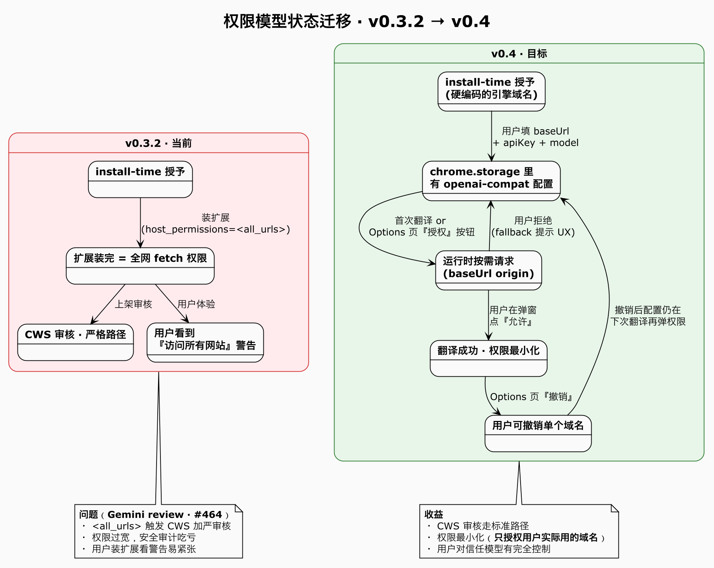
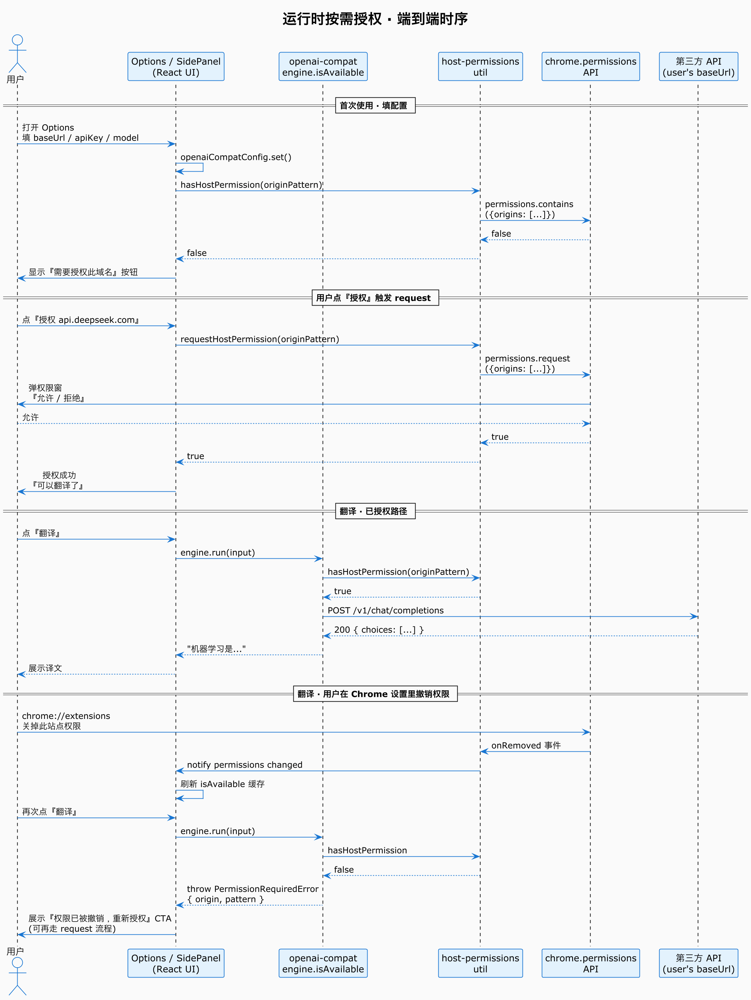
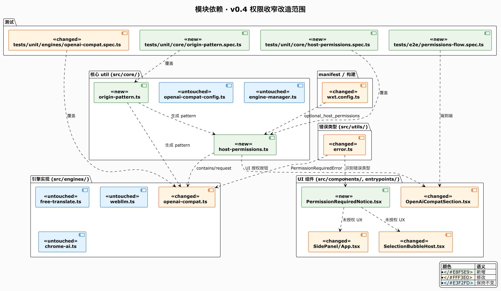
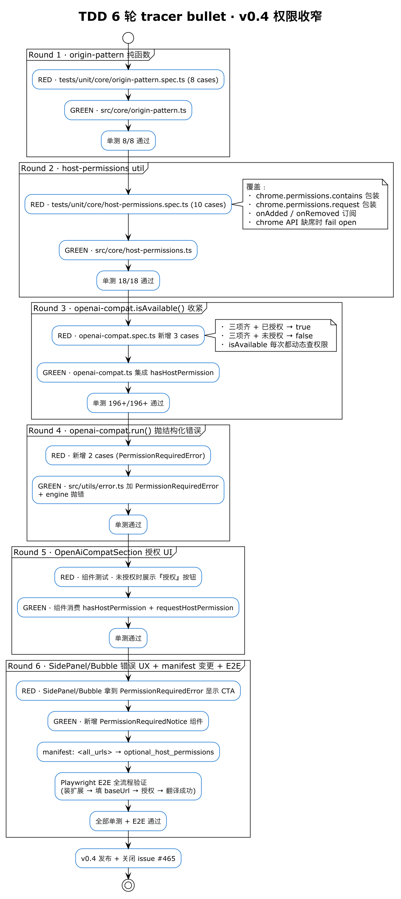

# v0.4 权限收窄规划 · Optional Host Permissions

Issue：[gandli/ai-proofduck-extension#465](https://github.com/gandli/ai-proofduck-extension/issues/465)
上游意见：Gemini bot code review on PR #464

---

## 一句话背景

**v0.3.2** 用 `host_permissions: ['<all_urls>']` 解 P0 有效，但 Gemini review 指出两个后患：

1. **Chrome Web Store 审核加严** — `<all_urls>` 触发人工审核 + 潜在拒绝
2. **权限过宽** — 用户装扩展看到 "此扩展可以访问所有网站"

**v0.4 收窄目标：**
- `translate.googleapis.com`（免费翻译）+ WebLLM 权重源 仍 hardcode 在 `host_permissions`
- 用户自建的 `openai-compat` baseUrl（用户 BYOK 域名）改走 `optional_host_permissions` + **运行时按需请求**

---

## 状态迁移



源码：[`00-state-transition.puml`](./00-state-transition.puml)

---

## 运行时时序

覆盖 4 条主链路：**首次填配置 → 用户点授权 → 已授权翻译 → 撤销后再翻译**。



源码：[`01-runtime-permission-flow.puml`](./01-runtime-permission-flow.puml)

---

## 模块依赖 · 改造范围

绿色新增 · 橙色修改 · 蓝色保持不变。



源码：[`02-component-map.puml`](./02-component-map.puml)

---

## TDD 6 轮 tracer bullet

严格 RED→GREEN→REFACTOR，每轮垂直切片。禁止水平化。



源码：[`03-tdd-roadmap.puml`](./03-tdd-roadmap.puml)

---

## 关键契约

### `extractOriginPattern(baseUrl: string): string`

- **输入**：用户填的 `baseUrl`（`https://api.deepseek.com/v1` / `http://localhost:11434` 等）
- **输出**：Chrome match pattern（`https://api.deepseek.com/*` / `http://localhost:11434/*`）
- **规则**：一律丢弃 path 换 `/*`，保留端口，缺 protocol 抛错

### `hasHostPermission(pattern): Promise<boolean>`

- 包装 `chrome.permissions.contains`
- **chrome API 缺席 or 抛错时 fail open** — 测试环境 / MV2 兼容 / 权限 API 关闭时不锁死功能

### `requestHostPermission(pattern): Promise<boolean>`

- 包装 `chrome.permissions.request`
- **必须在用户手势里调用**（Chrome 强制），所以 UI 层要在 click handler 里同步 await
- chrome API 缺席时**抛错**（不能静默 true，用户操作场景必须真实）

### `PermissionRequiredError`

```ts
class PermissionRequiredError extends Error {
  origin: string;       // https://api.deepseek.com
  pattern: string;      // https://api.deepseek.com/*
}
```

- `openai-compat.run()` 未授权时抛此错
- SidePanel / SelectionBubble 识别此错误 → 展示 `PermissionRequiredNotice` 组件

---

## 测试覆盖矩阵

| 层 | 文件 | 目的 |
|---|---|---|
| 单元 | `origin-pattern.spec.ts` | 8 case · URL → pattern 规范化 |
| 单元 | `host-permissions.spec.ts` | 10 case · chrome API 包装 + 兜底 |
| 单元 | `openai-compat.spec.ts` | 新增 5 case · isAvailable/run 检查权限 |
| 组件 | `OpenAiCompatSection.spec.tsx` | 授权按钮显示条件 + 点击调 request |
| E2E | `permissions-flow.spec.ts` | 真扩展 · 完整授权流程 |

---

## 里程碑

| 版本 | 内容 | 状态 |
|---|---|---|
| v0.3.2 | `<all_urls>` 保 4 引擎链路可用 | ✅ 已发布 |
| **v0.4.0** | **收窄至 `optional_host_permissions`** | 📅 本 issue |
| v0.4.1+ | CWS 上架 | 待 v0.4 稳定 |
